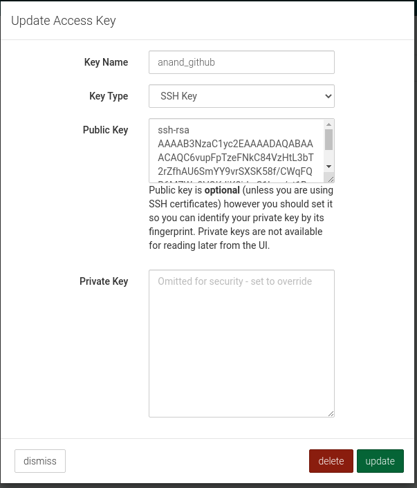
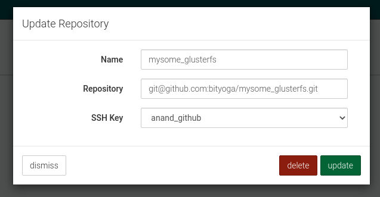
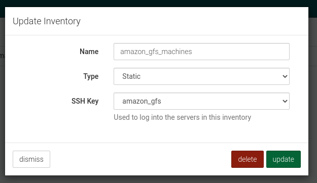
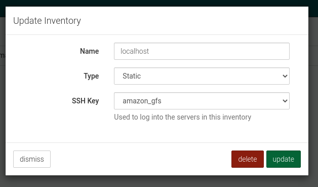
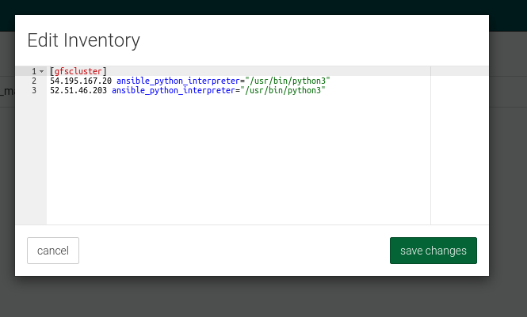
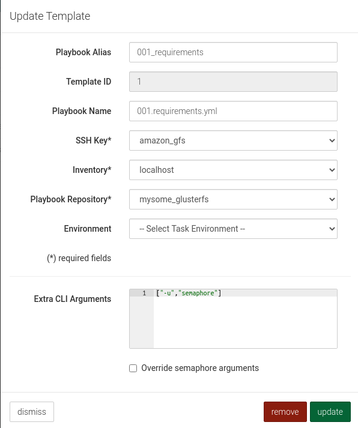
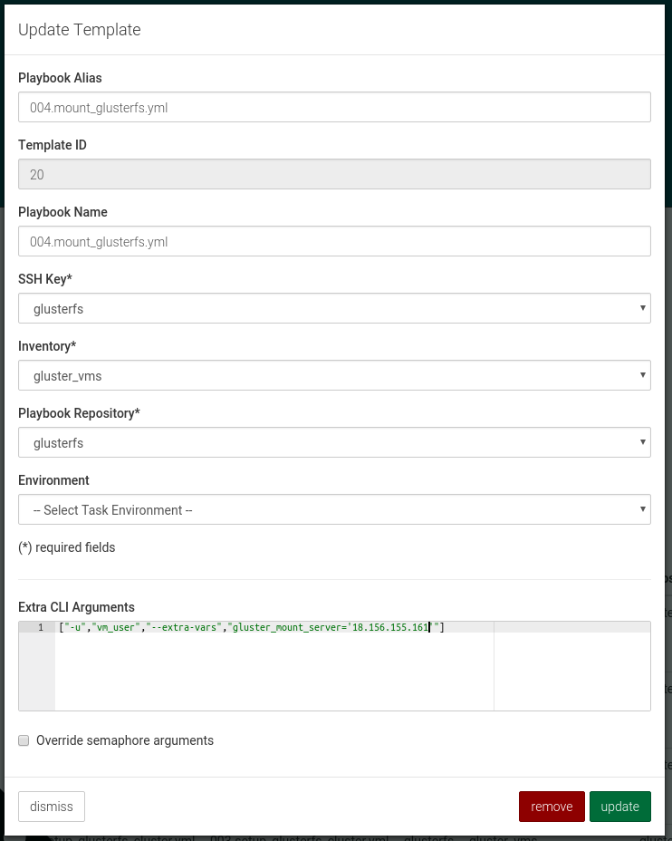
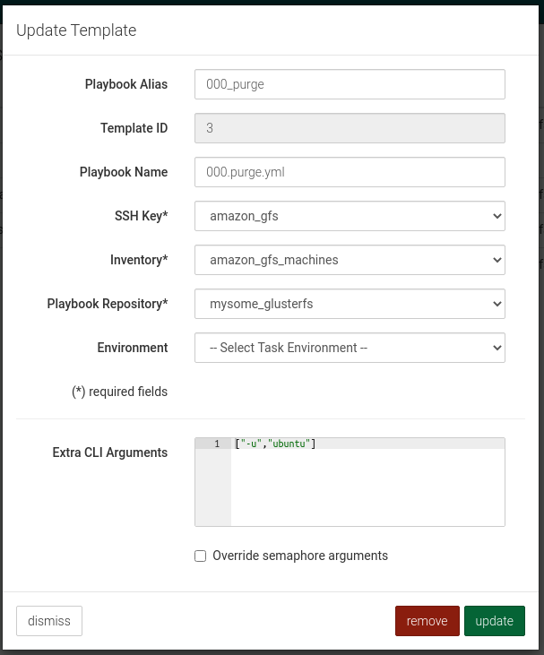

# Semaphore config instructions
## Pre-requisites: 
- Ensure that **ansible-semaphore is set up**. Please see [https://github.com/ansible-semaphore/semaphore] for further details on setting up ansible-semaphore.
Once ansible-semaphore is installed, you can verify it by accessing its url.

## ansible-semaphore Instructions:

- **1) Create Access keys** - Click "Key Store" from the side-menu and click "create key" on top right corner
  - **Github ssh key** - ssh key of the github repository to be used
  - **Remote Machines ssh keys** - ssh key to access the resource machines of the cloud provider
  
  
  
- **2) Import github repository** - Click "Playbook Repositories" from the side-menu and click "create repository" on top right corner
  - Import the **mysome_glusterfs** using the **Github ssh key** created in step 1
  
  
  
- **3) Update Inventory** - Click "Inventory" from the side-menu and click "create inventory" on top right corner
  - Create two inventories for **Remote machines** and **localhost** using the **Remote Machines ssh keys** created in step 1
  
  **Remote machine inventory example :**
  
  
  
  **localhost inventory example :**
  
  
  
  - **Edit Remote machine inventory -** click "edit inventory" on the **remote machine's inventory** and update the ip addresses of the machines.
  
  
  
- **4) Create Task Templates** - Click "Task Templates" from the side-menu and click "new template" on top right corner
  - Create 5 Task Templates for the 5 playbooks as shown in the figure below:
  
  **For 001.requirements.yml**
  
  - Select **localhost** inventory
  - **Extra CLI arugments for 001.requirements.yml task -** ["-u","semaphore"]
  
  
  
    **For 004.mount_glusterfs.yml**
  
  - Select **gluster_fs** inventory
  - **Extra CLI arugments for 004.mount_glusterfs task -** ["-u","ubuntu"]
  - (Replace "ubuntu" as per the username having root access in the remote machines)
  - (Replace "18.156.155.161" with one of the ips from the gluster_fs inventory
  
  
  
   **For other tasks**
  
  - Select **gluster_fs** inventory
  - **Extra CLI arugments for all other tasks -** ["-u","ubuntu"]  (Replace "ubuntu" as per the username having root access in the remote machines)
  
  
    
- **5) Run Tasks** 
  - Run all of the 5 Tasks one by one.
  - Click "run" green button on the right corner of the each tasks
  - Click "run" green button on the bottom right corner of the "create task" pop up
  
  
  
  
  
  
 
  
